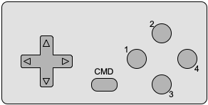

# Hardware Overview
The main components of the hardware are the [RISC-V processor](#processor), [flash memory](#flash-memory), [RAM](#ram), [chipset](./chipset.md), [multi-button controller](#multi-button-controller), [cartridge](#cartridge-rom) and video controller. This section outlines the hardware components as they are currently designed. The architects are currently refining the system, so changes may occur, or more hardware may become available at a later date. Below is the overall memory map of the RISC-V Console:

| Base Address | Size              | Description                           |
| ------------ | ----------------- | ------------------------------------- |
| 0x00000000   | 0x1000000 (16MiB) | [Firmware Flash](#firmware-flash)     |
| 0x20000000   | 0x1000000 (16MiB) | [Cartridge ROM](#cartridge-rom)       |
| 0x40000000   | 0x40 (72B)        | [Chipset Registers](./chipset.md)     |
| 0x50000000   | 0x100000 (1MiB)   | [Video Controller Memory](./video.md) | 
| 0x70000000   | 0x1000000 (16MiB) | [RAM](#ram)                           |

## Processor
The main processor of the game console is a RISC-V RV32EM. The processor is the same as the base RV32I except that it has only 16 registers instead of 32. In addition, the processor supports the M standard extension Integer Multiplication and Division, and the ZiCSR Control and Status Register extensions. The [RISC-V Instruction Set Manual Volume I: Unprivileged ISA](https://github.com/riscv/riscv-isa-manual/releases/download/Ratified-IMAFDQC/riscv-spec-20191213.pdf) and [The RISC-V Instruction Set Manual Volume II: Privileged Architecture](https://github.com/riscv/riscv-isa-manual/releases/download/Ratified-IMFDQC-and-Priv-v1.11/riscv-privileged-20190608.pdf) are provided to you as references on Canvas, and can also be found at https://riscv.org/technical/specifications/. The processor currently only supports Machine privilege mode, so any “game” will have complete control over the system when its instructions are executed.

## Firmware Flash
The firmware of the console where your operating system will reside is composed of flash memory. The flash memory is currently slated to be 16MB in size. The flash memory is currently only written during system development, but in field reprogramming may be made possible in the future.

## RAM
The main memory for the system is currently slated to be 16MB in size. The current design is to disallow execution from RAM, and since the access to the Flash Memory is a single cycle there isn’t a need to migrate instruction into RAM.

## Cartridge ROM
The game cartridges consist of ROM and will hold the game application on them. When inserted into the system the ROM is mapped directly into memory and can be read in a single cycle just as flash memory can. The insertion or removal of a cartridge can generate an interrupt through the chipset, and the current status can be determined through a memory mapped register.

## Multi-Button Controller
The multi-button controller has a four-direction pad, four toggle buttons, and a `CMD` button. All buttons in the controller are implemented as simple digital switches, so only have an on or off status. The status of the buttons and control pad can be read through a memory mapped register in the [chipset](./chipset.md). The `CMD` button can generate an interrupt via the [chipset](./chipset.md). Below is an illustration of the proposed physical controller.

