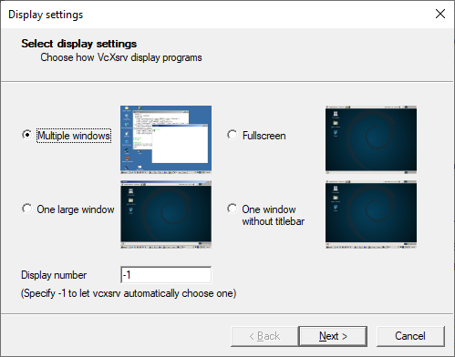
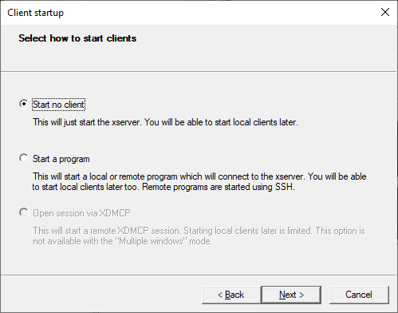
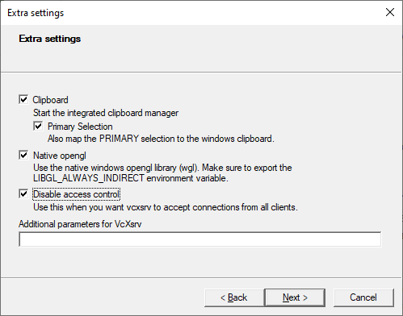
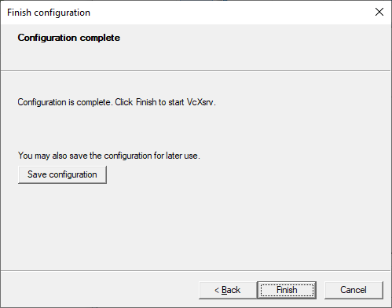
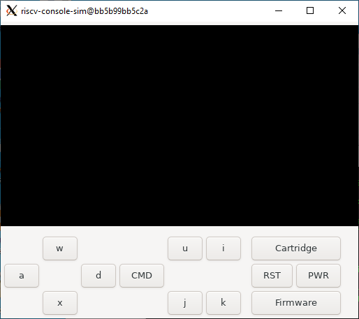
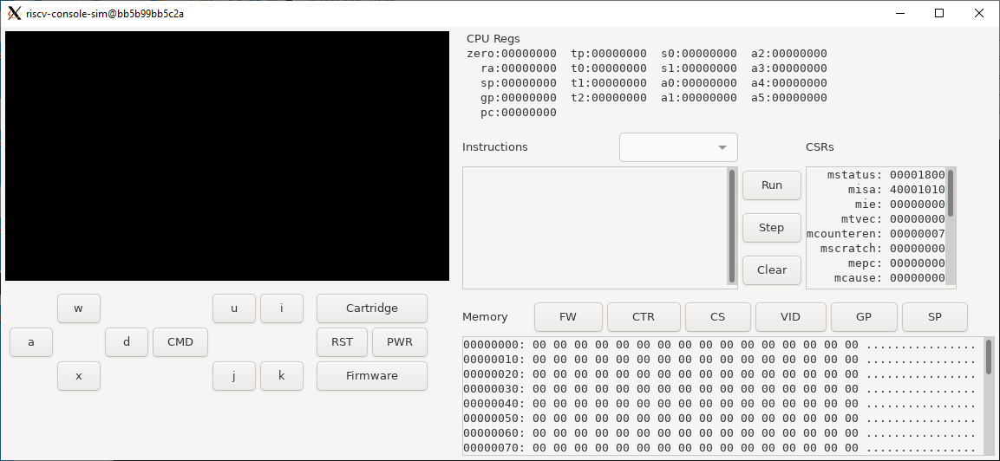

# PowerShell Getting Started
An alternative to running the `rvconsole.sh` bash script is to use the `rvconsole.ps1` PowerShell script. The directions assume that you have git, and Docker installed on your machine. If you have not already installed an X server such as [VcXsrv](https://sourceforge.net/projects/vcxsrv/) on your machine, you may want to following the [Installing X Server](#installing-x-server) directions.

## Installing X Server
The [VcXsrv](https://sourceforge.net/projects/vcxsrv/) X Server has been successfully tested on Windows 10 for use with the simulator. The server was successfully installed using [Chocolatey](https://chocolatey.org/). These steps are derived from those outlined [here](https://dev.to/darksmile92/run-gui-app-in-linux-docker-container-on-windows-host-4kde).
1. Install [Chocolatey](https://chocolatey.org/) using the directions at [here](https://chocolatey.org/install).
2. Install [VcXsrv](https://sourceforge.net/projects/vcxsrv/) by running the following command in PowerShell:
```
choco install vcxsrv
```
3. Configure [VcXsrv](https://sourceforge.net/projects/vcxsrv/) by running Xlaunch from the start menu or from icon on the Desktop and follow the prompts:
   1. Click Next

   
   
   2. Click Next

   

   3. Select "Disable access control", then click Next

   

   4. Save the configuration by clicking "Save configuration", then click Finish

   

The [VcXsrv](https://sourceforge.net/projects/vcxsrv/) X Server should be up and running now. This will allow for the simulator to successfully launch.

### Clone Repository
The code is available on github. If you have ssh setup for git start by cloning the repository with the following command:
```
git clone git@github.com:UCDClassNitta/riscv-console.git
```
You should see something like:
```
Cloning into 'riscv-console'...
remote: Enumerating objects: 176, done.
remote: Counting objects: 100% (176/176), done.
remote: Compressing objects: 100% (111/111), done.
remote: Total 176 (delta 71), reused 163 (delta 63), pack-reused 0
Receiving objects: 100% (176/176), 694.17 KiB | 3.71 MiB/s, done.
Resolving deltas: 100% (71/71), done.
```

You can also clone using the repository using the GitHub CLI using the command:
```
gh repo clone UCDClassNitta/riscv-console
```

### Launch Docker Container
Once the repository has been cloned, open PowerShell if it is not already open. Change directories into the riscv-console and run the console launch script with the command:
```
powershell -ExecutionPolicy Bypass -File .\rvconsole.ps1
```
The script will build the base RISC-V Docker image riscv_base that has the RISC-V build tool chain. This will take an exceptional amount of time, potentially on the order of hours. This build should only have to be done once. Once the base image is built the RISC-V development environment Docker image `riscv_console_dev`. The second image the builds upon the base should build quickly. Once the image is built the script will launch a container name `riscv_console_run`. This will mount the current riscv-console directory into the `/code` directory of the container allowing for source files to be edited on the host machine as well as within the container. Once the container is launched you should see a prompt like:
```
root@fedcba9876543210:/code#
```

### Verify RISC-V Tools
The next step is to build the RISC-V example program to test on the simulator. Change directory into `/code/riscv-example` and then run `make`. This should build an example that will put `Hello World!` on the simulator screen and have an `X` that will move based upon the controller direction buttons. 

### Launch Simulator
You can launch the simulator with the full path using the command:
```
/code/runsim.sh
```
This should build the simulator if it hasn't been built yet and will launch the simulator using X11 assuming everything is installed properly. The script will launch the simulator under the docker user instead of root. This may be necessary for Linux clients. You should see the simulator window that looks like: 



You can now select the example program by hitting the Firmware button and navigating to the `/code/riscv-example/bin` directory. Either the `riscv-console-example`, or `riscv-console-example.strip` file can be loaded. Once the PWR button can be pushed and the `Hello World!` message with an X should appear on the screen. Pressing the direction buttons on the simulator or the associated keys should move the `X` in the particular direction. The simulated CPU can be shut down by hitting the PWR button again. This should dump the status of the registers and memory so may take a while. Once the simulated CPU is shutdown the PWR button will no longer be highlighted. The simulator can be closed by hitting the appropriate close button for the window.

The simulator can also be run in debug mode by adding the `-d` option to the `riscv-console-sim` program or even to the `runsim.sh` script. You should see the simulator window that looks like following in debug mode: 



The `Run` button will run the system until it is clicked again, or until a breakpoint is hit. The `Step` button will execute a single instruction, and the `Clear` button will clear all breakpoints. Breakpoints can be toggled by double clicking the associated instruction. The `FW`, `CTR`, `CS`, and `VID` buttons will jump to the Firmware, Cartridge, Chipset, and Video Memory base addresses. The `GP` and `SP` buttons jump to the memory specified by the `gp` and `sp` registers.
