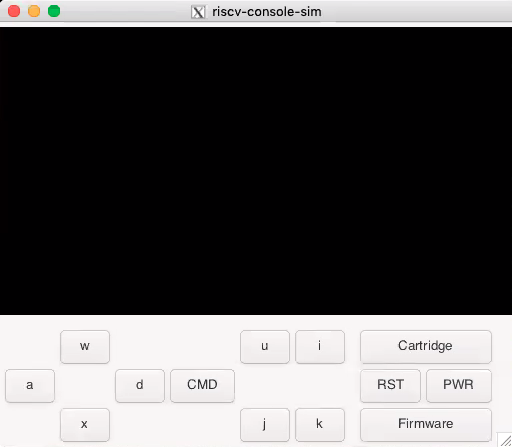
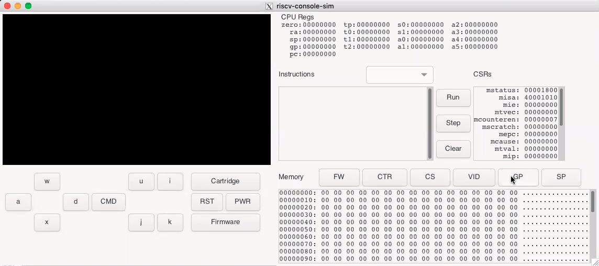

# Simulator Overview
The RISC-V Console Simulator is designed to compile and run on a Linux environment that supports [GTK+3](https://developer.gnome.org/gtk3/stable/). 

## Table of Contents
* [Simulator Overview](#simulator-overview)
    * [Table of Contents](#table-of-contents)
    * [Building Simulator](#building-simulator)
    * [Running Simulator](#running-simulator)
    * [Configuration](#configuration)

## Building Simulator
The simulator may be compiled directly on OS-X, Windows, Cygwin etc. if the appropriate packages are installed. The Docker container that is created with `rvconsole.sh` script is designed to have all packages necessary to compile the simulator. The script is also designed to allow X11 forwarding out of the container so that the simulator can be compiled and run inside the simulator. 

## Running Simulator
The simulator can be run by using the `runsim.sh` script, or by running the built executable `riscv-console-sim` in the bin directory. There are two modes, [Normal Mode](#normal-mode) and [Debug Mode](#debug-mode). In [Normal Mode](#normal-mode) the simulated system will run as fast as possible, where in [Debug Mode](#debug-mode) the system can be run, stopped or stepped.

### Normal Mode
When the simulator is run in Normal Mode it will operate the CPU as fast as possible. It will also attempt to maintain timer and video refresh according to real time. The interface in Normal Mode will look similar to the screenshot below.



The `w`, `a`, `d`, and `x` buttons shown in the screen are the direction buttons for the controller and can be controlled by pressing the associated key. The `u`, `i`, `j` and `k` buttons shown in the screen are the button 1 - 4 of the controller and can be controlled by pressing the associated key. The `CMD` is the controller's command button, which is capable of generating an interrupt in the simulated system (See [Multi-Button Controller Status Register](./chipset.md#multi-button-controller-status-register) for more information). The `PWR` and `RST` buttons are the power and reset buttons respectively. When the power is on the simulator will continue to simulate the RISC-V CPU and the associated peripherals. The `Firmware` button will "program" the simulated console's flash memory from an ELF (Executable and Linkable Format) file. The `Cartridge` button will "insert" a cartridge into the simulated console using an ELF file. If the cartridge is successfully loaded, then the button will remain on. Pressing the button again will "remove" the cartridge from the system.

### Debug Mode
When the simulator is run in Debug Mode it will operate the CPU and peripherals in lock step. This means that the timer and video refresh may not be related to the desired real time update unless the [CPU_FREQ](#cpu_freq) is set appropriately. The interface in Debug Mode will look similar to the screenshot below. The main difference is between the two interfaces is the registers/memory inteface on the right hand side in Debug Mode.



The CPU Registers appear at the top of the debug section of the interface. Below is the instruction window that will hold the instructions when the Firmware and/or Cartridge is loaded. The current instruction will be bolded. The dropdown to the right of the Instructions will hold the list of program labels that are found in the loaded ELF files. When a label is selected the Instruction window will be transitioned to have the label at the top of the window. Double clicking on an instruction in the window will toggle breakpoint at that instruction. A `@` symbol will appear to the left of the instruction when a breakpoint is set. The `Run`, `Step`, and `Clear` buttons to the right of the Instruction window control the operation of the simulated system. The `Run` button will run the system until a breakpoint is hit, or until until the `Run` button is hit again. **IMPORTANT NOTE: The CPU Registers, Current Instruction, CSRs and Memory will not update until the system stops.** The `Step` button will step the CPU one instruction. The `Clear` button will clear all breakpoints set in the system.

The CSRs (Control and Status Registers) are to the right of the system control buttons. Below the Instructions and the CSRs is the Memory section. The window shows 16 bytes per line with each line having the address, the 16 bytes in hexadecimal, and the ASCII representation of the data. The `FW`, `CTR`, `CS` and `VID` buttons will jump the memory window to the beginning of the firmware, cartridge, chipset, and video memory respectively. The `GP` button will jump to `0x800` below the `gp` register setting, this shows the base of the global memory. The `SP` button will jump to the location of the `sp` (stack pointer) register. When the `SP` is set, the memory will be listed in decending instead of ascending order. 

## Configuration
The simulator looks for a `.riscv_console.cfg` file in the users home directory in order to load the configuration. The format of the configuration file is the name of a variable followed the value separated by a space. Comment lines can be specified by starting the line with a `#` symbol.
```
# Override the default controller mapping
UP_KEY i
DOWN_KEY m
LEFT_KEY j
RIGHT_KEY l
BUTTON1_KEY w
BUTTON2_KEY e
BUTTON3_KEY s
BUTTON4_KEY d
```


### UP_KEY
`UP_KEY` will set the keyboard key that will be used for up direction on the multi-button controller. The default is `w`.

### DOWN_KEY
`DOWN_KEY` will set the keyboard key that will be used for down direction on the multi-button controller. The default is `x`.

### LEFT_KEY
`LEFT_KEY` will set the keyboard key that will be used for left direction on the multi-button controller. The default is `a`.

### RIGHT_KEY
`RIGHT_KEY` will set the keyboard key that will be used for right direction on the multi-button controller. The default is `d`.

### BUTTON1_KEY
`BUTTON1_KEY` will set the keyboard key that will be used for button 1 on the multi-button controller. The default is `u`.

### BUTTON2_KEY
`BUTTON2_KEY` will set the keyboard key that will be used for button 2 on the multi-button controller. The default is `i`.

### BUTTON3_KEY
`BUTTON3_KEY` will set the keyboard key that will be used for button 3 on the multi-button controller. The default is `j`.

### BUTTON4_KEY
`BUTTON4_KEY` will set the keyboard key that will be used for button 4 on the multi-button controller. The default is `k`.

### WIDGET_SPACING
`WIDGET_SPACING` will specify the spacing between buttons and other widgets in the UI. The default is 5 pixels.

### INSTRUCTION_LINES
`INSTRUCTION_LINES` will specify the number of instructions that are visible in the window in debug mode. The default is 8 instructions.

### MEMORY_LINES
`MEMORY_LINES` will specify the number of memory lins that are visible in the window in debug mode. The default is 8 lines.

### SCREEN_TIMERMS
`SCREEN_TIMERMS` will specify the the video tick period in milliseconds, the value will be reflected in the [Video Clock Period Register](./chipset.md#video-clock-period-register). The default is 10 milliseconds.

### TIMERUS
`TIMERUS` will specify the the machine timer period in microseconds, the value will be reflected in the [Machine Clock Period Register](./chipset.md#machine-clock-period-register). The default is 1,000 microseconds.

### CPU_FREQ
`CPU_FREQ` is the assumed RISC-V CPU frequency during debug mode. Since the frequecy of the machine timer and the video tick are fixed to the speed of the simulated CPU, this value combined with `SCREEN_TIMERMS` and `TIMERUS` will determine the downsampling rate for each clock.