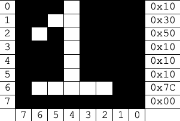

# Video Controller Model 01
The video controller is responsible for rendering the graphics for the console. The video controller has 1MiB of memory and renders a 512 x 288 (16:9 aspect ratio) screen. The video controller has a [text mode](#text-mode) and a [graphics mode](#graphics-mode). 

## Memory Map
The video controller has 1MiB of memory that is used for controlling what is displayed on the screen. The table below shows the memory map of the Video Controller.

| Base Address | Size             | Description                                                      |
| ------------ | ---------------- | ---------------------------------------------------------------- |
| 0x50000000   | 0xB4000 (720KiB) | [Background Data](#background-data-memory-map)                   |
| 0x500B4000   | 0x40000 (256KiB) | [Large Sprite Data](#large-sprite-data-memory-map)               |
| 0x500F4000   | 0x8000 (32KiB)   | [Small Sprite Data](#small-sprite-data-memory-map)               |
| 0x500FC000   | 0x1000 (4KiB)    | [Background Palettes](#background-and-sprite-palette-memory-map) |
| 0x500FD000   | 0x1000 (4KiB)    | [Sprite Palettes](#background-and-sprite-palette-memory-map)     |
| 0x500FE000   | 0x800 (2KiB)     | [Font Data](#font-data)                                          |
| 0x500FE800   | 0x900 (2.25KiB)  | [Text Data](#text-data)                                          |
| 0x500FF100   | 0x14 (20B)       | [Background Controls](#background-control-memory-map)            |
| 0x500FF114   | 0x100 (256B)     | [Large Sprite Controls](#large-sprite-controls-memory-map)       |
| 0x500FF214   | 0x200 (512B)     | [Small Sprite Controls](#small-sprite-controls-memory-map)       |
| 0x500FF414   | 0x4 (4B)         | [Mode Control Register](#mode-control)                           |

## Text Mode
The default of the video controller is to start in text mode that provides 64 x 36 characters each of 8 x 8 pixels. The MSX font is loaded into the font memory at reset. The text mode is capable of rendering up to 256 different characters, but by default the MSX font only supports the printable ASCII characters from `'!'` to `'~'`. 

#### Font Data
Font data is organized as 8-byte bit masks for each of the 256 characters. The order of the bytes is from top row to bottom row, with the order of bits being from left to right with left being most significant bit. An example of the bitmask can be seen below:

#### Text Data
The text data is ordered from top row down to the bottom row and from left to right. Address 0 offset for the text data is the upper left corner.

## Graphics Mode
The graphics mode provides support for five ["background" full resolution images](#background-images), 64 [large sprites](#large-sprites) (up to 64 x 64 pixels in size), and 128 [small sprites](#small-sprites) (up to 16 x 16 pixels in size). All images support 256 unique colors from a 32-bit RGBA [palette](#palette). There are four [background palettes](#background-and-sprite-palette-memory-map) and four [sprite palettes](#background-and-sprite-palette-memory-map).

### Background Images
The "background" images are full 512 x 288 pixel resolution. Each "background" image is composed of 147,456B (512 x 288 1B values) pixel values and a 32-bit control structure. The control structure controls the X, Y and Z position of the image, as well as a selector for the palette to use. The 10-bit X and Y offsets control the upper left corner position of the image. The 3-bit Z position specifies the Z plane in which the image will be rendered. Images are rendered in increasing Z position; within a Z position, images are rendered in order of their image number. 

#### Background Data Memory Map
Below is the memory map layout for the background data images.
| Base Address | Size             | Description             |
| ------------ | ---------------- | ----------------------- |
| 0x50000000   | 0x24000 (144KiB) | Background Data Image 0 |
| 0x50024000   | 0x24000 (144KiB) | Background Data Image 1 |
| 0x50048000   | 0x24000 (144KiB) | Background Data Image 2 |
| 0x5006C000   | 0x24000 (144KiB) | Background Data Image 3 |
| 0x50090000   | 0x24000 (144KiB) | Background Data Image 4 |

#### Background Control Memory Map
Below is the memory map layout for the background controls.
| Base Address | Size    | Description           |
| ------------ |-------- | --------------------- |
| 0x500FF100   | 0x4(4B) | Background Controls 0 |
| 0x500FF104   | 0x4(4B) | Background Controls 1 |
| 0x500FF108   | 0x4(4B) | Background Controls 2 |
| 0x500FF10C   | 0x4(4B) | Background Controls 3 |
| 0x500FF110   | 0x4(4B) | Background Controls 4 |

#### Background Control Structure
Below is the structure of the background controls.
| Bit         | 31..25   | 24..22 | 21..12 | 11..2 | 1..0    |
| ----------- | -------- | ------ |------- | ----- | ------- |
| Description | Reserved | Z      | Y+288  | X+512 | Palette |

Notice that the X and Y offsets are the interpreted as X+512 and Y+288. This means that the background image width and height are subtracted from the X and Y values respectively. A value of 0 in the X and/or Y of the control structure will keep the background image off screen.

### Large Sprites
The large sprites are images up to 64 x 64 pixels with a minimum size of 33 x 33 pixels (though smaller sprites could effectively be rendered by using transparency). Each sprite is composed of 4,096B (64 x 64 1B values) pixel values and a 32-bit control structure. The control structure controls the X and Y position of the sprite, the width and height, as well as a selector for the palette to use. The 10-bit X and 9-bit Y offsets control the upper left corner position of the spite. Images are rendered in order of their sprite number and are always rendered on Z plane 4.

#### Large Sprite Data Memory Map
Below is the memory map layout for the large sprite data.
| Base Address | Size          | Description          |
| ------------ | ------------- | -------------------- |
| 0x500B4000   | 0x1000 (4KiB) | Large Sprite Data 0  |
| 0x500B5000   | 0x1000 (4KiB) | Large Sprite Data 1  |
| ...          | ...           | ...                  |
| 0x500F2000   | 0x1000 (4KiB) | Large Sprite Data 62 |
| 0x500F3000   | 0x1000 (4KiB) | Large Sprite Data 63 |

#### Large Sprite Controls Memory Map
Below is the memory map layout for the large sprite controls.
| Base Address | Size    | Description              |
| ------------ | ------- | ------------------------ |
| 0x500FF114   | 0x4(4B) | Large Sprite Controls 0  |
| 0x500FF118   | 0x4(4B) | Large Sprite Controls 1  |
| ...          | ...     | ...                      |
| 0x500FF20C   | 0x4(4B) | Large Sprite Controls 62 |
| 0x500FF210   | 0x4(4B) | Large Sprite Controls 63 |

Below is the structure of the large sprite controls. 

#### Large Sprite Control Structure
|  Bit        | 31       | 30..26 | 25..21 | 20..12 | 11..2 | 1..0    |
| ----------- | -------- | ------ | ------ | ------ | ----- | ------- |
| Description | Reserved | H-33   | W-33   | Y+64   | X+64  | Palette |

Notice that the X and Y offsets are the interpreted as X+64 and Y+64. This means that the large sprite max width and max height are subtracted from the X and Y values respectively. A value of 0 in the X and/or Y of the control structure will keep the large sprite off screen. Also notice that the width and height are W-33 and H-33 respectively. This means that 33 will be added to the value in the control structure to get the desired width and height of the sprite.

### Small Sprites
The large sprites are images up to 16 x 16 pixels with a minimum size of 1 x 1. Each sprite is composed of 256B (16 x 16 1B values) pixel values and a 32-bit control structure. The control structure controls the X, Y and Z position of the sprite, the width and height, as well as a selector for the palette to use. The 10-bit X and 9-bit Y offsets control the upper left corner position of the spite. The 3-bit Z position specifies the Z plane in which the sprite will be rendered. Sprites are rendered in increasing Z position; within a Z position, sprites are rendered in order of their sprite number.

#### Small Sprite Data Memory Map
Below is the memory map layout for the small sprite data. 
| Base Address | Size         | Description           |
| ------------ | ------------ | --------------------- |
| 0x500F4000   | 0x100 (256B) | Small Sprite Data 0   |
| 0x500F4100   | 0x100 (256B) | Small Sprite Data 1   |
| ...          | ...          | ...                   |
| 0x500FBE00   | 0x100 (256B) | Small Sprite Data 126 |
| 0x500FBF00   | 0x100 (256B) | Small Sprite Data 127 |

#### Small Sprite Controls Memory Map
Below is the memory map layout for the small sprite controls. 
| Base Address | Size    | Description               |
| ------------ | ------- | ------------------------- |
| 0x500FF214   | 0x4(4B) | Small Sprite Controls 0   |
| 0x500FF218   | 0x4(4B) | Small Sprite Controls 1   |
| ...          | ...     | ...                       |
| 0x500FF40C   | 0x4(4B) | Small Sprite Controls 126 |
| 0x500FF410   | 0x4(4B) | Small Sprite Controls 127 |

#### Small Sprite Control Structure
Below is the structure of the small sprite controls. 
| Bit         | 31..29 | 28..25 | 24..21 | 20..12 | 11..2 | 1..0    |
| ----------- | ------ | ------ | ------ | ------ | ----- | ------- |
| Description | Z      | H-1    | W-1    | Y+16   | X+16  | Palette |

Notice that the X and Y offsets are the interpreted as X+16 and Y+16. This means that the small sprite max width and max height are subtracted from the X and Y values respectively. A value of 0 in the X and/or Y of the control structure will keep the small sprite off screen. Also notice that the width and height are W-1 and H-1 respectively. This means that 1 will be added to the value in the control structure to get the desired width and height of the sprite.

### Palettes
Each palette is composed of 256, 32-bit RGBA values. Each entry supports 16,777,216 possible colors ignoring transparency. If alpha values are used other than 255 (full opacity) the RGB values must be premultiplied by the alpha value. This means that the maximum R, G, or B value can be is equal to the alpha value. The behavior for non premultiplied values is undefined, but likely will lead to the alpha channel being ignored.

#### Background and Sprite Palette Memory Map
Below is the memory layout for the background and sprite palettes. 
| Base Address | Size         | Description          |
| ------------ | ------------ | -------------------- |
| 0x500FC000   | 0x400 (1KiB) | Background Palette 0 |
| 0x500FC400   | 0x400 (1KiB) | Background Palette 1 |
| 0x500FC800   | 0x400 (1KiB) | Background Palette 2 |
| 0x500FCC00   | 0x400 (1KiB) | Background Palette 3 |
| 0x500FD000   | 0x400 (1KiB) | Sprite Palette 0     |
| 0x500FD400   | 0x400 (1KiB) | Sprite Palette 1     |
| 0x500FD800   | 0x400 (1KiB) | Sprite Palette 2     |
| 0x500FDC00   | 0x400 (1KiB) | Sprite Palette 3     |

#### Background Palette 0 Memory Map
Below is the layout for Background Palette 0, all other palettes are organized in the same fashion. 
| Base Address | Size         | Description          |
| ------------ | ------------ | -------------------- |
| 0x500FC000   | 0x4(4B)      | Palette Entry 0      |
| 0x500FC004   | 0x4(4B)      | Palette Entry 1      |
| ...          | ...          | ...                  |
| 0x500FC3F8   | 0x4(4B)      | Palette Entry 254    |
| 0x500FC3FC   | 0x4(4B)      | Palette Entry 255    |

#### Palette Entry
Below is the structure of the palette entries where A is alpha, R is red, G is green and B is blue. All values of R, G, B should be less than or equal to that of A. 
| Bit         | 31..24 | 23..16 | 15..8 | 7..0 |
| ----------- | ------ | ------ | ----- | ---- |
| Description | A      | R      | G     | B    |

### Mode Control 
The mode control register controls the mode of the video and the refresh rate of the screen. The mode bit selects between Text Mode 0 and Graphics Mode 1. The refresh rate is a down sample from the input tick clock. When set to 0 (the default after reset) the refresh will occur every 10 ticks. It is possible to down sample the refresh rate to 1 for 1 of the clock ticks, and down to 1 for every 127 clock ticks. 

#### Mode Control Register 
Below is the layout of the Mode Control Register.
| Bit         | 31..8    | 7..1    | 0    |
| ----------- | -------- | ------- | ---- |
| Description | Reserved | Refresh | Mode |

